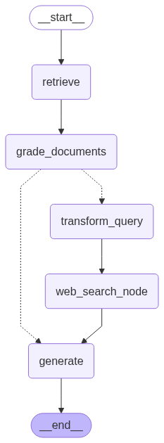
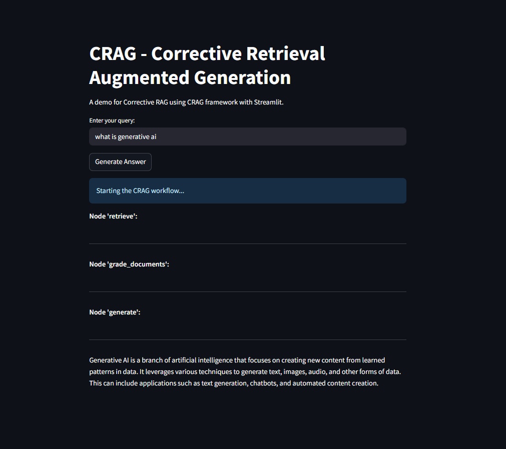
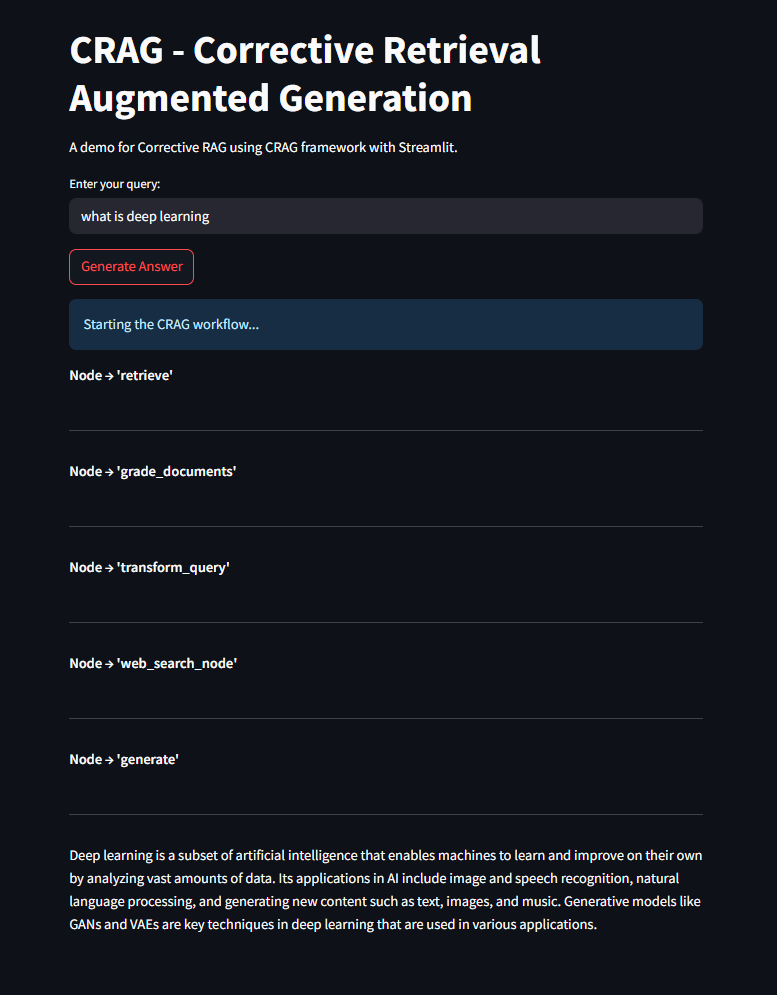

<h1 align=center> CorrectiveRAG </h1>

## Steps:

1. Git clone the repository and Define template of the project

```bash
# create template.py
python3 template.py
```

2. Define setup.py scripts (**The setup.py** is a module used to build and distribute Python packages. It typically contains information about the package)


3. Create environment and install dependencies

```bash
conda create -n crag python=3.11 -y
conda activate crag
pip install -r requirements.txt
```

4. Define custom exception and define logger (**The Logging** is a means of tracking events that happen when some software runs)

5. Run the codes in jupyter-notebook
```bash
notebook/experiments.ipynb
```

6. `pipeline\data_loader.py`

7. `pipeline\grade_documents.py`

8. `pipeline\workflow.py`



9. `app.py`

- Generate Answer From Documents


- Generating use Web Search
