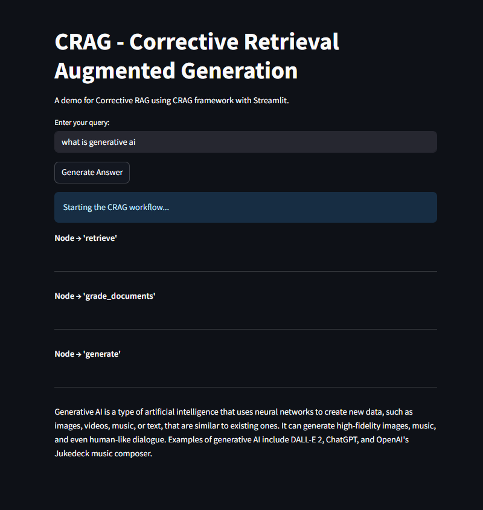

<h1 align=center> CorrectiveRAG </h1>

## Steps:

1. Git clone the repository and Define template of the project

```bash
# create template.py
python3 template.py
```

2. Define setup.py scripts (**The setup.py** is a module used to build and distribute Python packages. It typically contains information about the package)


3. Create environment and install dependencies

```bash
conda create -n crag python=3.11 -y
conda activate crag
pip install -r requirements.txt
```

4. Define custom exception and define logger (**The Logging** is a means of tracking events that happen when some software runs) 
- Uses CustomException to handle errors with context.

- Utilizes logger for structured logging and debugging.

5. Run the codes in jupyter-notebook (Store qroq api and tavily api in .env file)
```bash
notebook/experiments.ipynb
```

6. `src\pipeline\data_loader.py`
    - fetch_contents(): Fetches data from specified URLs
    - store_data(): Stores processed data into a vector database
    - create_retriever(): Creates a retriever for similarity-based document search

7. `src\pipeline\grade_documents.py` -> grade the relevance of retrieved documents to a user's question

8. `pipeline\workflow.py`
- The class within `workflow.py` class implements a pipeline for dynamically generating accurate responses by combining retrieval, document grading, query transformation, and LLM-based generation.

    ##### Methods:
        - retrieve: Retrieves documents based on a question.
        - generate: Generates an answer using the retrieved documents.
        - grade_documents: Filters relevant documents from the retrieved set.
        - transform_query: Reformulates the question for better search efficiency.
        - web_search: Searches the web for additional information if required.
        - decide_to_generate: Determines whether to generate a response or reformulate the query.
        - build_graph: Constructs and compiles the state graph for the workflow.


9. `app.py` -> adding streamlit to define the UI

- Generated Answer From Documents


- Generated Answer Using Web Search


10. Adding Docker to the project `Dockerfile`

```bash
1. docker build -t crag-app .
2. docker run -p 8501:8501 --env-file .env crag-app
```
